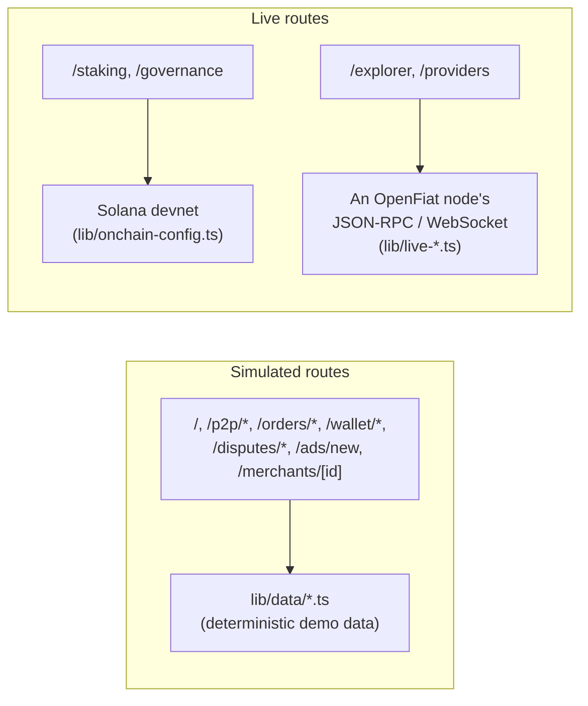

# Architecture — openfiat-app

Next.js App Router, no backend of its own. Every route is one of two kinds:

## Simulated routes

The majority of the app — the P2P exchange book and country pages, orders
and the trade room, wallet, disputes, the advertisement wizard, merchant
profiles — reads from static, deterministic data in `lib/data/` (fixed-seed
PRNG where randomness is needed, so server and client render the same
thing). There is no backend call and no wallet signature involved. The
floating badge from `components/simulated-badge.tsx` marks this — note it
currently renders unconditionally in `app/layout.tsx`, so it also appears on
the live routes below; its presence isn't proof a given page is simulated.

## Live routes

Two independent "live" surfaces exist, talking to two different networks:

- **Solana devnet** (`/staking`, `/governance`) — `lib/onchain-config.ts`
  holds the real devnet program ids for `openfiat-escrow`,
  `openfiat-staking`, and `openfiat-governance` (via `@openfiat/sdk`'s
  `onchain` module) and a shared `Connection` to
  `https://api.devnet.solana.com`. `components/staking/stake-form.tsx`
  builds a real `initializeStakeAccountIx`/`stakeIx` transaction and submits
  it via the connected wallet's own `signAndSendTransaction`; the
  governance vote form follows the same pattern with the governance
  program's `cast_vote`. `lib/wallet-connection.ts` holds the injected
  wallet-provider connection state (Phantom, Solflare, Backpack, Coinbase
  Wallet, Ledger); `lib/onchain-decode.ts` decodes the raw Anchor account
  bytes read back from a submitted transaction's resulting accounts.
- **An OpenFiat node** (`/explorer`, `/providers`) — `lib/live-explorer.ts`
  and `lib/live-providers.ts` call a node's JSON-RPC and WebSocket surface
  directly (no `@openfiat/sdk` client dependency; both hand-roll the
  request/response shapes they need). The endpoint is whichever node
  `lib/node-preference.ts`'s access-node picker currently resolves to —
  that picker's own default node list is itself simulated data
  (`lib/data/network.ts`), so genuine data requires pointing it at a real
  node.

These two live surfaces are unrelated: a wallet connected for staking/
governance has no bearing on which OpenFiat node Explorer/Providers talk to,
and vice versa.

## Where routes are cut over next

See the repository [README](../README.md)'s Status section for which
routes are live today; cutovers land one route at a time (`git log --oneline`
shows each one — e.g. "cut over to live devnet data", "cut /providers over to
live Service Registry data").
